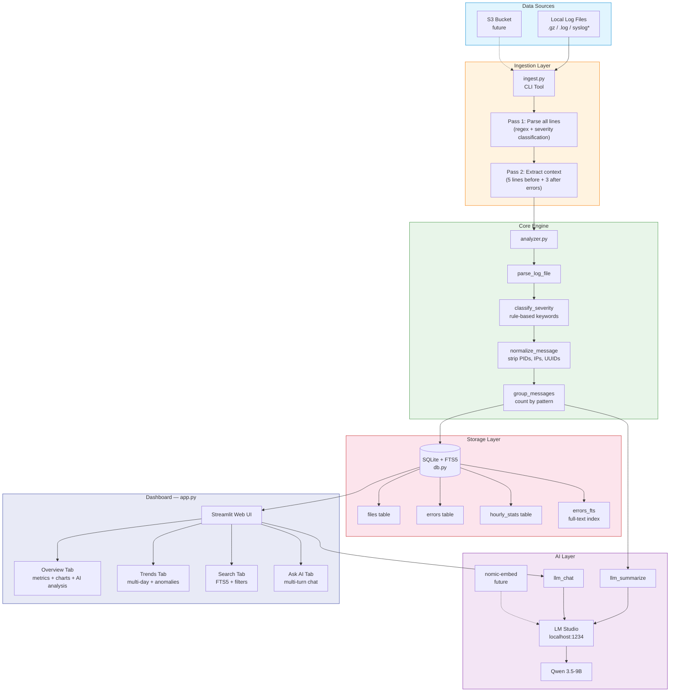
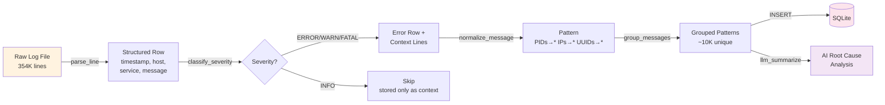
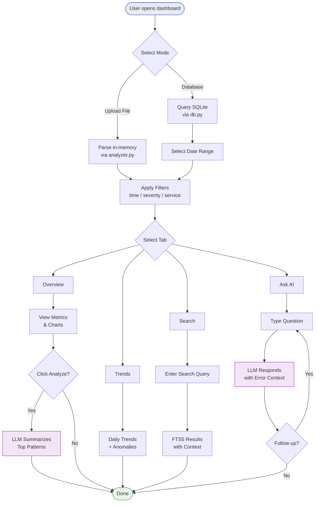
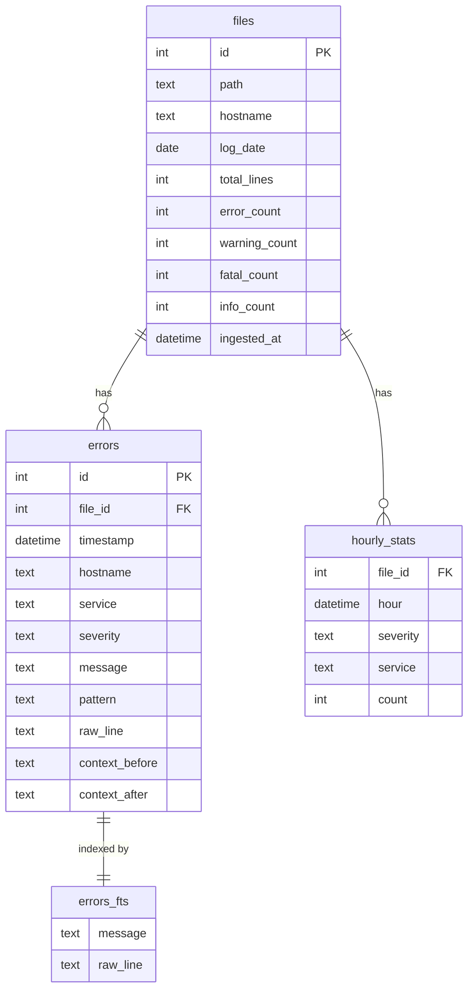

# Log Analyzer — Flow Diagrams

## System Architecture

```mermaid
graph TB
    subgraph Sources["Data Sources"]
        S1[Local Log Files<br/>.gz / .log / syslog*]
        S2[S3 Bucket<br/>future]
    end

    subgraph Ingestion["Ingestion Layer"]
        ING[ingest.py<br/>CLI Tool]
        P1["Pass 1: Parse all lines<br/>(regex + severity classification)"]
        P2["Pass 2: Extract context<br/>(5 lines before + 3 after errors)"]
    end

    subgraph Core["Core Engine"]
        AN[analyzer.py]
        PARSE[parse_log_file]
        CLASS[classify_severity<br/>rule-based keywords]
        NORM[normalize_message<br/>strip PIDs, IPs, UUIDs]
        GROUP[group_messages<br/>count by pattern]
    end

    subgraph Storage["Storage Layer"]
        DB[(SQLite + FTS5<br/>db.py)]
        T1[files table]
        T2[errors table]
        T3[hourly_stats table]
        T4[errors_fts<br/>full-text index]
    end

    subgraph AI["AI Layer"]
        LM[LM Studio<br/>localhost:1234]
        QWEN[Qwen 3.5-9B]
        EMB[nomic-embed<br/>future]
        SUM[llm_summarize]
        CHAT[llm_chat]
    end

    subgraph UI["Dashboard — app.py"]
        ST[Streamlit Web UI]
        TAB1[Overview Tab<br/>metrics + charts + AI analysis]
        TAB2[Trends Tab<br/>multi-day + anomalies]
        TAB3[Search Tab<br/>FTS5 + filters]
        TAB4[Ask AI Tab<br/>multi-turn chat]
    end

    S1 --> ING
    S2 -.-> ING
    ING --> P1 --> P2
    P2 --> AN
    AN --> PARSE --> CLASS --> NORM --> GROUP

    GROUP --> DB
    DB --> T1 & T2 & T3 & T4

    DB --> ST
    GROUP --> SUM --> LM --> QWEN
    ST --> CHAT --> LM
    EMB -.-> LM

    ST --> TAB1 & TAB2 & TAB3 & TAB4

    style Sources fill:#e1f5fe,stroke:#0288d1
    style Ingestion fill:#fff3e0,stroke:#f57c00
    style Core fill:#e8f5e9,stroke:#388e3c
    style Storage fill:#fce4ec,stroke:#c62828
    style AI fill:#f3e5f5,stroke:#7b1fa2
    style UI fill:#e8eaf6,stroke:#303f9f
```

## Data Processing Pipeline

```mermaid
flowchart LR
    A[Raw Log File<br/>354K lines] -->|parse_line| B[Structured Row<br/>timestamp, host,<br/>service, message]
    B -->|classify_severity| C{Severity?}
    C -->|ERROR/WARN/FATAL| D[Error Row +<br/>Context Lines]
    C -->|INFO| E[Skip<br/>stored only as context]
    D -->|normalize_message| F[Pattern<br/>PIDs→* IPs→* UUIDs→*]
    F -->|group_messages| G[Grouped Patterns<br/>~10K unique]
    G -->|INSERT| H[(SQLite)]
    G -->|llm_summarize| I[AI Root Cause<br/>Analysis]

    style A fill:#fff3e0
    style H fill:#fce4ec
    style I fill:#f3e5f5
```

## User Interaction Flow

```mermaid
flowchart TD
    START([User opens dashboard]) --> MODE{Select Mode}

    MODE -->|Upload File| FILE[Parse in-memory<br/>via analyzer.py]
    MODE -->|Database| DBMODE[Query SQLite<br/>via db.py]

    FILE --> FILTERS[Apply Filters<br/>time / severity / service]
    DBMODE --> DATESEL[Select Date Range] --> FILTERS

    FILTERS --> VIEW{Select Tab}

    VIEW --> OV[Overview]
    VIEW --> TR[Trends]
    VIEW --> SR[Search]
    VIEW --> AI[Ask AI]

    OV --> METRICS[View Metrics<br/>& Charts]
    METRICS --> ANALYZE{Click Analyze?}
    ANALYZE -->|Yes| LLM1[LLM Summarizes<br/>Top Patterns]
    ANALYZE -->|No| DONE([Done])

    TR --> TREND_CHARTS[Daily Trends<br/>+ Anomalies]

    SR --> QUERY[Enter Search Query] --> RESULTS[FTS5 Results<br/>with Context]

    AI --> QUESTION[Type Question] --> LLM2[LLM Responds<br/>with Error Context]
    LLM2 --> FOLLOWUP{Follow-up?}
    FOLLOWUP -->|Yes| QUESTION
    FOLLOWUP -->|No| DONE

    LLM1 --> DONE
    TREND_CHARTS --> DONE
    RESULTS --> DONE

    style START fill:#e8eaf6,stroke:#303f9f
    style DONE fill:#e8f5e9,stroke:#388e3c
    style LLM1 fill:#f3e5f5,stroke:#7b1fa2
    style LLM2 fill:#f3e5f5,stroke:#7b1fa2
```

## Database Schema

```mermaid
erDiagram
    files ||--o{ errors : "has"
    files ||--o{ hourly_stats : "has"
    errors ||--|| errors_fts : "indexed by"

    files {
        int id PK
        text path
        text hostname
        date log_date
        int total_lines
        int error_count
        int warning_count
        int fatal_count
        int info_count
        datetime ingested_at
    }

    errors {
        int id PK
        int file_id FK
        datetime timestamp
        text hostname
        text service
        text severity
        text message
        text pattern
        text raw_line
        text context_before
        text context_after
    }

    hourly_stats {
        int file_id FK
        datetime hour
        text severity
        text service
        int count
    }

    errors_fts {
        text message
        text raw_line
    }
```
