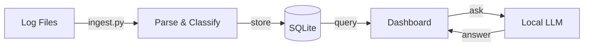

# High-Level Design

## What Is It?

A self-hosted, AI-powered log analysis tool that turns raw syslog files into actionable insights — no cloud, no cluster, no complexity.

## One-Line Architecture

```
Log Files  →  Parse & Store  →  Query & Visualize  →  AI Explains
```

## Three Layers

```
┌──────────────────────────────────────────────┐
│                 PRESENTATION                  │
│                                              │
│          Streamlit Web Dashboard             │
│    Overview · Trends · Search · AI Chat      │
│                                              │
├──────────────────────────────────────────────┤
│                  INTELLIGENCE                 │
│                                              │
│           Local LLM  (LM Studio)             │
│      Summarization · Root Cause · Chat       │
│                                              │
├──────────────────────────────────────────────┤
│                DATA & PROCESSING              │
│                                              │
│   Ingest → Parse → Classify → Normalize      │
│          SQLite + FTS5 Storage               │
│                                              │
└──────────────────────────────────────────────┘
```

## How Data Flows



## Key Components

| Component | File | Role |
|-----------|------|------|
| **Dashboard** | `app.py` | Web UI — charts, tables, filters, chat |
| **Engine** | `analyzer.py` | Parsing, classification, grouping, LLM calls |
| **Storage** | `db.py` | SQLite schema, queries, full-text search |
| **Ingestion** | `ingest.py` | CLI to bulk-load log files into the database |

## The Core Idea

```
354,000 raw log lines/day
        ↓  normalize
   ~10,000 unique patterns
        ↓  group & count
      ~100 top patterns
        ↓  send to LLM
    1 summary with root causes
```

Raw logs are noisy. The system normalizes away variable parts (PIDs, IPs, UUIDs), groups by pattern, and sends only the top patterns to a local LLM — keeping AI costs zero and analysis fast.

## Tech Choices

| Decision | Choice | Why |
|----------|--------|-----|
| UI | Streamlit | Zero frontend code, built-in charts |
| Storage | SQLite + FTS5 | No server, handles our scale (~3.5 GB), full-text search built in |
| AI | Local LLM via LM Studio | Free, private, no API keys |
| Classification | Rule-based keywords | Fast, deterministic, no LLM needed |
| Dependencies | Just `streamlit` | Everything else is Python stdlib |
